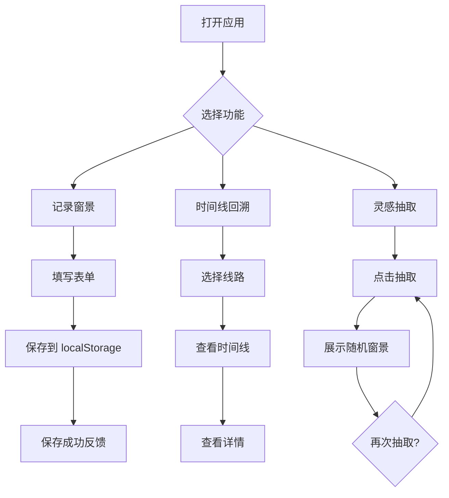

## 1. 产品概述

"公交车窗景采样器"是一个面向写作爱好者与城市观察者的本地化 Web 应用。用户可以记录乘坐公交时窗外的景色片段——线路、座位方向、时间、天气、招牌、树木密度、行人状态和一句观察笔记——并以时间线方式回溯某条线路的窗景，也能随机抽取一段窗景作为写作灵感。

- 解决的问题：城市公交窗景转瞬即逝，缺少一种轻量、结构化的记录方式
- 目标用户：城市写作者、散文/小说作者、生活记录爱好者

## 2. 核心功能

### 2.1 用户角色
无需多角色，单用户本地使用。

### 2.2 功能模块
1. **记录页**：填写窗景采样表单（线路、区间、座位方向、时间、天气、招牌、树木密度、行人状态、观察笔记）
2. **时间线页**：按线路筛选，以时间线形式展示该线路所有窗景记录
3. **灵感页**：随机抽取一段窗景，配合写作灵感提示，支持重新抽取

### 2.3 页面详情

| 页面名称 | 模块名称 | 功能描述 |
|----------|----------|----------|
| 记录页 | 表单模块 | 输入线路名、区间、座位方向（左/右）、自动获取当前时间、选择天气、输入招牌文字、选择树木密度（稀疏/适中/茂密）、选择行人状态（稀少/零星/密集）、输入观察笔记 |
| 记录页 | 提交反馈 | 提交成功后展示动画反馈，并清空表单 |
| 时间线页 | 线路筛选 | 下拉/搜索选择线路名，筛选该线路记录 |
| 时间线页 | 时间线展示 | 以竖向时间线展示记录卡片，每张卡片包含时间、天气图标、区间、笔记摘要 |
| 时间线页 | 详情弹窗 | 点击卡片弹出完整窗景信息 |
| 灵感页 | 随机抽取 | 大按钮点击后随机抽取一条窗景记录，以沉浸式卡片展示 |
| 灵感页 | 灵感提示 | 在随机窗景基础上生成写作角度提示（如"尝试以窗外招牌为线索写一个短篇"） |
| 灵感页 | 重新抽取 | 支持再次随机抽取新窗景 |

## 3. 核心流程

**记录流程**：用户打开记录页 → 填写窗景信息 → 点击保存 → 数据存入 localStorage → 显示保存成功动画

**回溯流程**：用户进入时间线页 → 选择线路 → 查看时间线 → 点击卡片查看详情

**灵感流程**：用户进入灵感页 → 点击抽取按钮 → 随机展示一段窗景 → 阅读灵感提示 → 可再次抽取

## 4. 用户界面设计

### 4.1 设计风格
- **主色调**：暮色暖橙 (#E8945A) 搭配深青 (#1A2F38)，模拟黄昏公交车窗的色调
- **辅助色**：柔雾灰 (#D4CFC4)、深夜蓝 (#0F1B24)
- **字体**：标题使用 Noto Serif SC（衬线体，书卷气），正文使用 Noto Sans SC
- **按钮风格**：圆角微阴影，主按钮暖橙实心，次按钮描边
- **布局**：左侧导航栏 + 右侧内容区，卡片式内容展示
- **图标**：线性风格（天气、树木、行人等用简笔线条图标）
- **整体氛围**：傍晚车窗、城市剪影、暖光与阴影交织，有文学质感

### 4.2 页面设计概览

| 页面名称 | 模块名称 | UI 元素 |
|----------|----------|---------|
| 记录页 | 表单模块 | 分组表单（路线信息组 + 窗景信息组 + 笔记组），输入框带柔和边框，选择器用自定义下拉，密度/行人用可视化的图标选择器 |
| 记录页 | 提交反馈 | 保存后出现飞出的车窗动画，渐隐消失 |
| 时间线页 | 线路筛选 | 顶部搜索框 + 线路标签快速选择 |
| 时间线页 | 时间线展示 | 竖向时间线，左侧时间标记，右侧卡片，天气小图标，卡片悬浮时微上浮 |
| 时间线页 | 详情弹窗 | 毛玻璃背景弹窗，大字体展示笔记，信息标签排列 |
| 灵感页 | 随机抽取 | 页面中央大型圆形按钮（车窗造型），点击后翻转展示窗景卡片 |
| 灵感页 | 灵感提示 | 卡片下方出现手写风格的提示文字，逐字显现动画 |
| 灵感页 | 重新抽取 | 底部「再采一段」按钮，带旋转动画 |

### 4.3 响应式
- 桌面优先设计，左侧固定导航
- 平板：导航栏收缩为底部标签栏
- 手机：底部标签栏，表单改为单列布局

### 4.4 3D 场景
不适用
