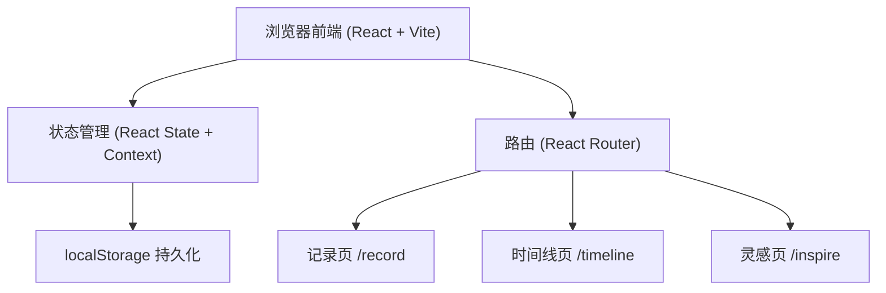
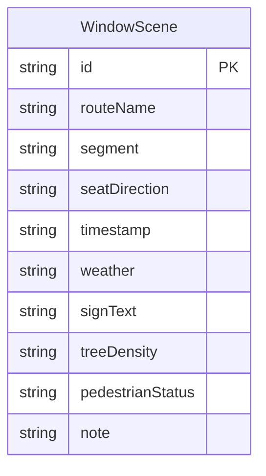

## 1. 架构设计



## 2. 技术说明

- **前端**：React@18 + Tailwind CSS@3 + Vite
- **初始化工具**：Vite (create-vite)
- **后端**：无（纯前端）
- **数据库**：localStorage（浏览器本地存储）

## 3. 路由定义

| 路由 | 用途 |
|------|------|
| / | 首页/记录页，填写窗景采样表单 |
| /timeline | 时间线页，按线路查看窗景记录 |
| /inspire | 灵感页，随机抽取窗景作为写作灵感 |

## 4. API 定义
无后端 API，所有数据操作通过 localStorage 进行。

数据操作封装为独立的 service 层：
- `saveScene(scene)` — 保存窗景记录
- `getAllScenes()` — 获取所有记录
- `getScenesByRoute(routeName)` — 按线路筛选
- `getRandomScene()` — 随机获取一条记录
- `deleteScene(id)` — 删除记录

## 5. 服务器架构
不适用

## 6. 数据模型

### 6.1 数据模型定义



### 6.2 数据定义

localStorage 键：`bus_window_scenes`

数据结构：
```typescript
interface WindowScene {
  id: string;
  routeName: string;
  segment: string;
  seatDirection: "左" | "右";
  timestamp: string;
  weather: "晴" | "多云" | "阴" | "小雨" | "大雨" | "雪" | "雾";
  signText: string;
  treeDensity: "稀疏" | "适中" | "茂密";
  pedestrianStatus: "稀少" | "零星" | "密集";
  note: string;
}
```

存储格式：`WindowScene[]` 的 JSON 序列化字符串
